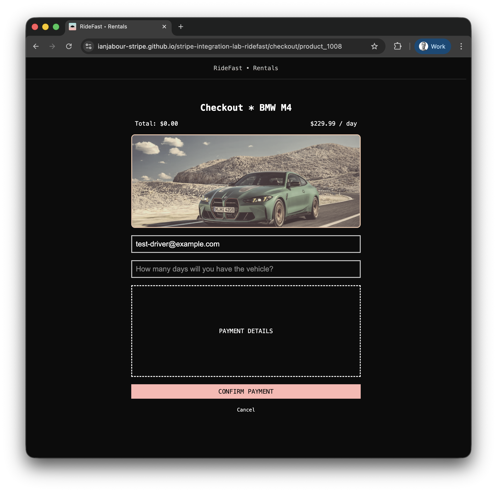

# Stripe Integration Lab

This repository provides the boilerplate UI for a car rental service company without any payment integration code added.

In practice, you should only need to update the `CheckoutPage.jsx` and `server.js` files to get a working Stripe integration.

## Running the sample

1. Build the application

~~~
npm install
~~~

2. Run the application (both client and server)

~~~
npm start
~~~

3. Go to [http://localhost:3000](http://localhost:3000)

(server will run on http://localhost:4242)